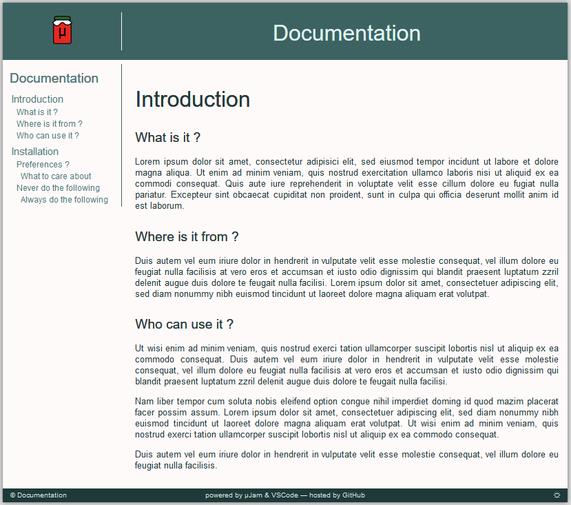

# Introduction 

## What is it ?
A [&mu;Jam](https://goessner.github.io/microjam/) template for web based project or product documentation.
Different markdown documentation files are accessible via a common sidebar.

<figure>
  
  <figcaption>Fig.1: &mu;Jam documentation template view</figcaption>
</figure>

## Where is it from ?
It is one of several basic templates for [&mu;Jam](https://goessner.github.io/microjam/) - the minimalistic Jamstack approach for building GitHub-Pages hosted websites.

## Who can use it ?
This template is open source and can be used by by everyone.
